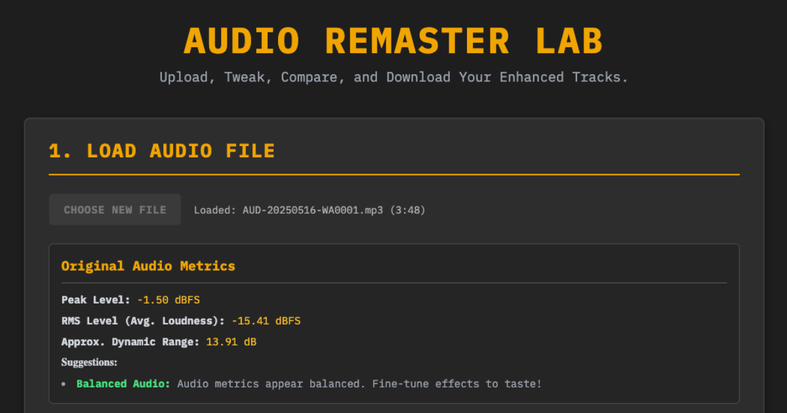

# 🎧 Audio Remastering Lab

A browser-based tool for enhancing audio tracks with professional-grade effects.

  

## 🚀 Overview

I created this tool to enable quick and simple remastering of music tracks created on [suno.com](https://suno.com) that I wrote with [lyric-genie.com](https://lyric-genie.com). The application provides an intuitive interface for applying EQ, compression, stereo enhancement, and other audio effects to your tracks.

## ✨ Features

- Parametric equalizer with bass, mid, and treble controls
- Dynamics processing with compressor and limiter
- Stereo enhancement and reverb effects
- Analog-style warmth/saturation
- Real-time A/B comparison between original and remastered audio
- Audio metrics analysis
- One-click download of processed audio

## 🔒 Privacy

**All processing is done entirely client-side in your browser.** 

Your audio files are never uploaded to any servers, ensuring complete privacy and data security. You can verify this by examining the source code in this repository.

## 🛠️ Development

This project was created with the assistance of Google's Gemini 2.5 Pro using the Canvas feature.

## 🌐 Try It Out

Visit [https://remaster.mbdr.ai](https://remaster.mbdr.ai) to use the Audio Remastering Lab. 
